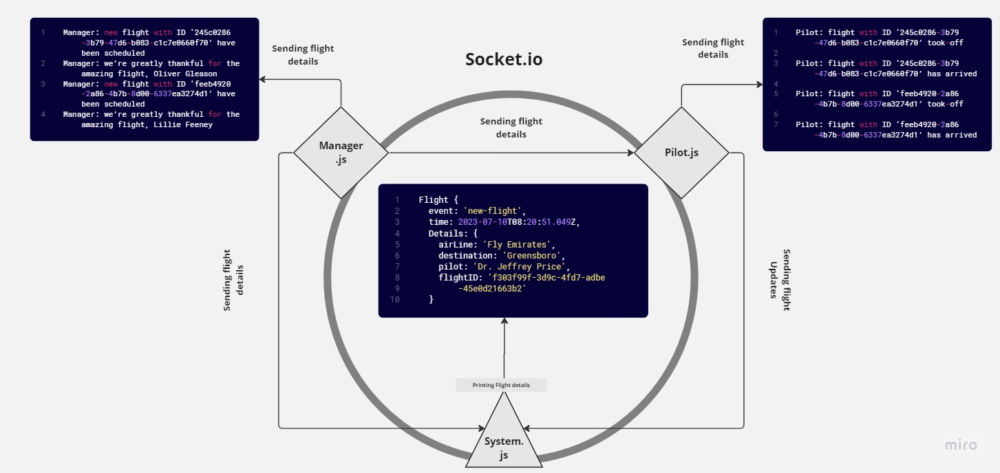

# Airline-system

## v.1

## Description (v.1)

This App is a system of Airline event logger, it keeps informing you with each flight updates. (using events built in node.js module)

.jpg)

## To run the application (v.1)

- Clone the repository
- Navigate to the folder of the code and each subfolder and run `npm i`
- run the code by typing `node system.js` in the terminal when in system directory

## v.2

## Description (v.2)

This App is a system of Airline event logger, it keeps informing you with each flight updates.(using socket.io)

## To run the application (v.2)

- Clone the repository
- Navigate to the folder of the code and each subfolder and run `npm i`

then in order:

1. run the code by typing `node system.js` in the terminal when in system directory
2. run the code by typing `node pilot.js` in the terminal when in pilot directory
3. run the code by typing `node manager.js` in the terminal when in manager directory